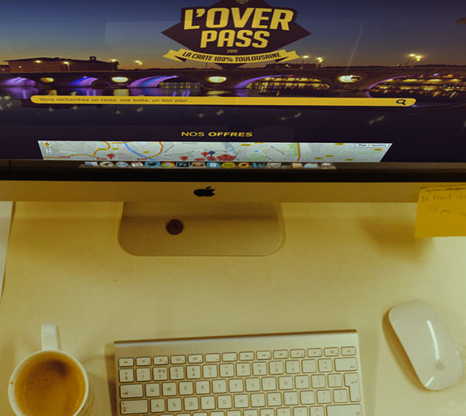
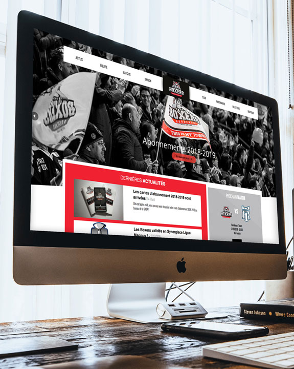
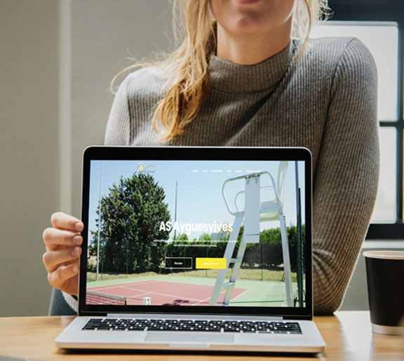

<!-- Main -->

<!-- One -->
<section id="one">
	

		<header class="major">
			<h2>Coder avec passion</h2>
		</header>
		

			Je ne résume pas le fait de coder à mon travail. Depuis mes débuts le code
			est, et restera, une passion. Voici donc une sélection de projets réalisés
			seul ou avec un associé allant du site web à l'application mobile.
		

	

</section>

<!-- Two -->
<section id="two" class="spotlights">
	<section>
		
		

			

				<header class="major">
					<h3>L'Overpass</h3>
				</header>
				

					L'Overpass est une carte de réduction dans la ville toulousaine orientée
					étudiant et soirées. Un ami s'occupe de la partie commerciale et je suis
					responsable de la partie technique qui comprends :  
					- Un site web propulsé par Wordpress 
					- Une application mobile codée avec React Native et se basant sur un
					module d'API développé pour Wordpress (je n'ai pas utilisé un module
					existant pour diverses raisons).
				

				<ul class="actions">
					<li><a href="https://loverpass.fr" target="_blank" class="button">Voir le projet en ligne</a></li>
				</ul>
			

		

	</section>
	<section>
		
		

			

				<header class="major">
					<h3>Boxers de Bordeaux</h3>
				</header>
				

					Avec un associé nous avons réalisé le site (Wordpress) et la boutique
					(Prestashop) pour l'équipe de hockey des Boxers de Bordeaux.  
					Au programme :  
					- Création d'un thème Wordpress  
					- Intégration de diverses API pour le classement, les joueurs et les
					résultats des matchs  
					- Intégration de templates mails pour des mailings 
					- Création d'un thème pour la boutique Prestashop (avec intégration Sage) 
					- Réalisation d'un module pour le maillot personalisé.
				

				<ul class="actions">
					<li><a href="https://www.hockey-boxers-de-bordeaux.fr/" target="_blank" class="button">Voir le site</a></li>
					<li><a href="https://boutique.hockey-boxers-de-bordeaux.fr/" target="_blank" class="button">Voir la boutique</a></li>
				</ul>
			

		

	</section>

	<!--<section>
		
		

			

				<header class="major">
					<h3>Tennis League</h3>
				</header>
				

					Description du projet  
					- Utilisation de ApiPlatform pour l'API 
					- ReactNative pour l'application mobile  
					- Création d'un crawler pour la récupération des tournois, matchs et
					résultats.
				

				<ul class="actions">
					<li><a href="generic.html" class="button" target="_blank">Learn more</a></li>
				</ul>
			

		

	</section>-->

	<section>
		
		

			

				<header class="major">
					<h3>Tennis Club Ayguesvives</h3>
				</header>
				

					Étant membre du bureau du club de tennis d'Ayguesvives (31), j'ai
					réalisé le site du club en utilisant Wordpress. Le but étant de
					propulser rapidement un site avec une admin facile et utilisable par
					des personnes non formés au web.
				

				<ul class="actions">
					<li><a href="https://www.tennis-ayguesvives.fr/" target="_blank" class="button">Voir le site</a></li>
				</ul>
			

		

	</section>
</section>

